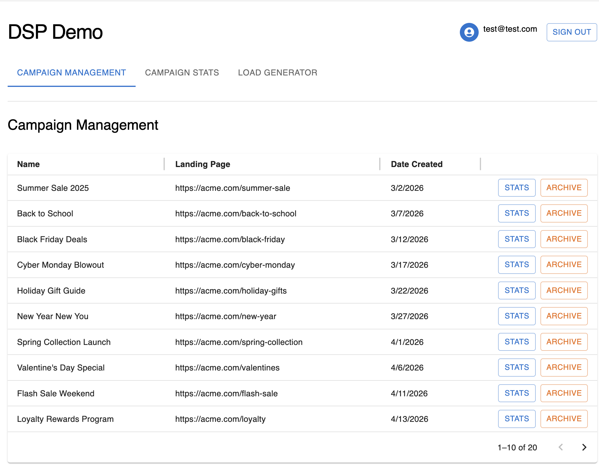
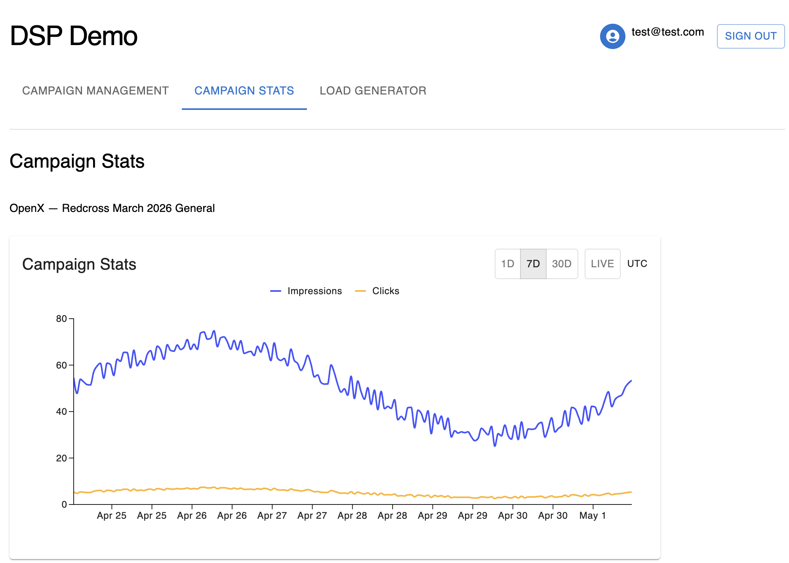
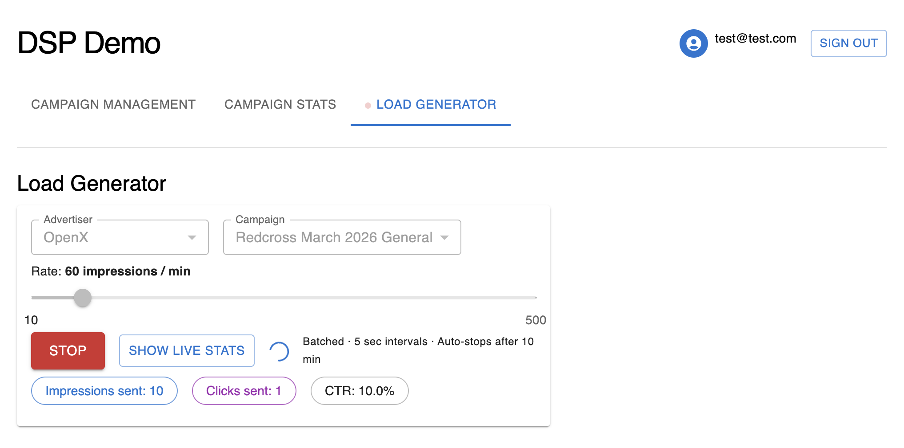
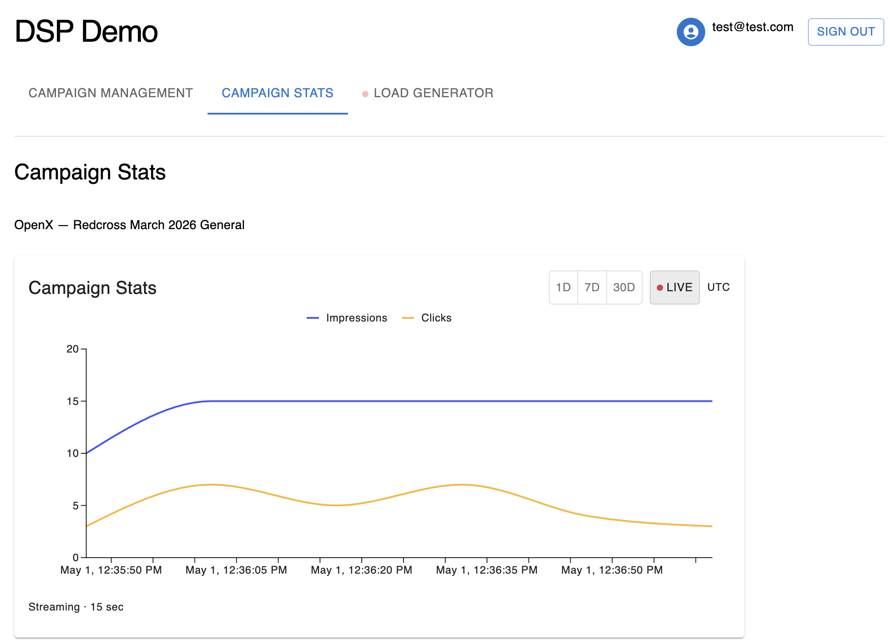

# DSP Demo — Frontend

React SPA for the [DSP Demo AdTech Campaign Analytics Platform](https://github.com/garygz/dsp-demo-project).

---

## Live App

**URL:** http://dsp-demo-ui-production-hosting-316159321784.s3-website-us-east-1.amazonaws.com

> ⚠️ Demo account — no sensitive data.

| Field | Value |
|---|---|
| User | test@test.com |
| Password | DspDemoTest! |

---

## Screenshots

**Campaign Management**

**Historical Stats**


**Load Generator**


**Live SSE Chart**


---

## Tech Stack

| | |
|---|---|
| Framework | React 19, Vite 8 |
| UI | MUI v9, MUI X-Charts |
| Routing | React Router v7 |
| State | React Context (Auth, LoadGenerator, ChartState) |
| Observability | Sentry |
| Tests | Vitest, Testing Library |

---

## Local Development

```bash
npm install
npm run dev       # http://localhost:5173
npm test          # run tests
npm run build     # production build
```

Dev login runs automatically on localhost — no password needed.

---

## Deployment

Static files are hosted on S3. Deployments are triggered by pushing to `main` via AWS CodePipeline → CodeBuild → S3 sync.

Infrastructure is managed with Terraform in the `infra/` directory. See the [backend repo](https://github.com/garygz/dsp-demo-project) for full infrastructure and system design documentation.
